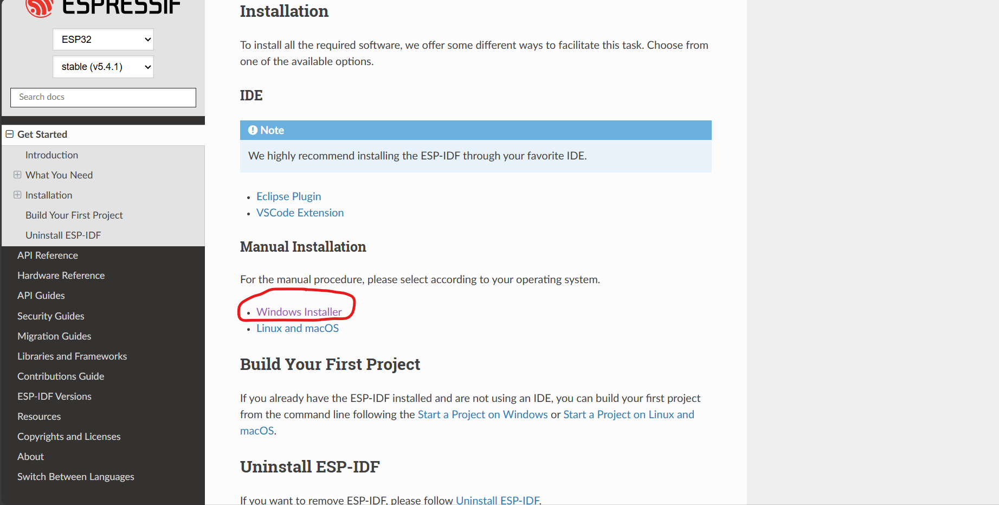
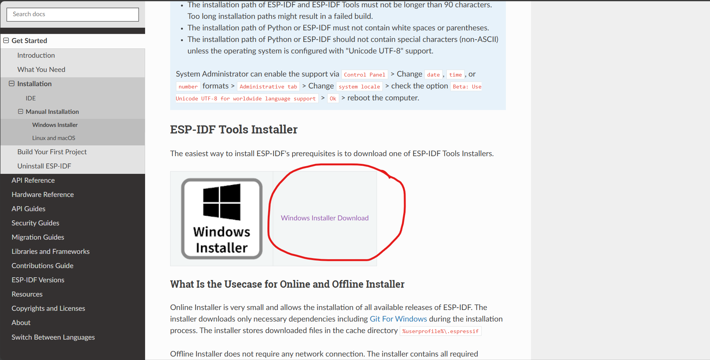

# 🔌 Thiết kế nhà thông minh sử dụng công nghệ BLE Mesh

> **Mô tả ngắn gọn:** Dự án thiết kế hệ thống nhà thông minh sử dụng công nghệ BLE Mesh. Hệ thống giúp điều khiển và giám sát các thiết bị trong nhà một cách linh hoạt, không cần kết nối Wi-Fi, phù hợp cho các ứng dụng IoT chi phí thấp.

## Mục Lục
- [Giới thiệu](#giới-thiệu)
- [Thông số kỹ thuật](#thông-số-kỹ-thuật)
- [Danh sách linh kiện](#danh-sách-linh-kiện)
- [Sơ đồ nguyên lý và PCB](#sơ-đồ-nguyên-lý-và-pcb)
- [Hướng dẫn lắp ráp](#hướng-dẫn-lắp-ráp)
- [Cài đặt môi trường](#cài-đặt-môi-trường)
- [Lập trình firmware](#lập-trình-firmware)
- [Cách sử dụng](#cách-sử-dụng)
- [Kiểm thử](#kiểm-thử)
- [Ảnh/Video demo](#ảnhvideo-demo)
- [Đóng góp](#đóng-góp)
- [Giấy phép](#giấy-phép)
- [Tác giả](#tác-giả)

## Giới Thiệu

- Dự án xây dựng một hệ thống nhà thông minh dựa trên công nghệ BLE Mesh, cho phép các thiết bị như công tắc, đèn, cảm biến khí gas, cảm biến cửa... giao tiếp với nhau trong mạng lưới không dây, không cần kết nối Internet liên tục. Mỗi thiết bị có thể đóng vai trò client, server hoặc relay trong hệ thống mesh.

- Người dùng chính là các hộ gia đình, văn phòng nhỏ, hoặc các khu căn hộ muốn triển khai giải pháp điều khiển thiết bị điện thông minh, tiết kiệm điện và đảm bảo an toàn (ví dụ: phát hiện rò rỉ khí gas hoặc mở cửa trái phép).

- Thiết kế phục vụ mục đích giáo dục, nghiên cứu và có thể mở rộng thành sản phẩm thương mại. Hệ thống giúp sinh viên, nhà phát triển hoặc doanh nghiệp nhỏ hiểu rõ về ứng dụng thực tiễn của BLE Mesh trong tự động hóa tòa nhà.

## Thông Số Kỹ Thuật

| Thành phần     | Thông tin               |
|----------------|-------------------------|
| MCU            | ESP32-WROOM-32          |
| Nguồn vào      | 5V qua USB hoặc DC      |
| Kết nối        | Bluetooth               |
| Kích thước PCB | Không có                |

---

## Danh Sách Linh Kiện

| Tên linh kiện             | Số lượng | Ghi chú                    |
|---------------------------|----------|----------------------------|
| ESP32 DevKit v1           | 3        | Vi điều khiển chính        |
| LED                       | 1        | LED đơn                    |
| Nút nhấn                  | 1        | Điều khiển thủ công        |

## Sơ đồ Nguyên lý và PCB ( Không có )

## Hướng dẫn lắp ráp ( Không có )

##  Cài đặt môi trường
### Cài đặt Microsoft Visual Studio Code 
- Truy cập trang chính thức: [Visual studio Code](https://code.visualstudio.com/).
- Nhấn nút **Download for Windows** hoặc chọn hệ điều hành khác (macOs, Linux).
		
Cài đặt 
- Chạy file .exe vừa tải về.
- Tích chọn các tùy chọn cần thiết ( **Add to PATH**, **Register as default editor**).
- Nhấn **Next** và hoàn tất cài đặt.
		
Cài các tiện ích cần thiết
- **C/C++**
- **PlatformIO**
- **ESP-IDF** ( Nếu không cài trong Extension thì có thể cài riêng ở ngoài).
### Cài đặt ESP-IDF thủ công
- Truy cập trang chính thức: [ESP-IDF](https://docs.espressif.com/projects/esp-idf/en/latest/esp32/get-started/index.html).
- Chọn hệ điều hành của bạn:
	- **Windows**
	- **Linux**
	- **MacOS**
- Cài đặt ( ở đây đang cài trên Windows)
	- Sau khi vào theo đường link trên, kéo xuống chọn download( ảnh minh họa)

	- Tiếp đến chọn **Windows Installer Download**

	- Chọn phiên bản mà bạn muốn rồi nhấn down( ở đây mình dùng ver 5.2.5)

	- Sau khi tải về hoàn tất tiến hành các bước cài đặt ESP-IDF.
	- Sau khi cài xong mở **ESP-IDF Command Prompt** để sử dụng.

## Lập trình firmware

- Ngôn ngữ: C.
- Công cụ: Visual Code, ESP-IDF Terminal.
- Trong dự án này, mình đang sử dụng 3 ESP-32 để mô phỏng 1 mạng mesh sử dụng BLE. 
- Trong đó:
	- 1 con ESP làm provisoner đảm nhận nhiệm vụ provisioning và gửi yêu cầu đến server. 
	- 1 con ESP đảm nhận nhiệm vụ làm server( khi cấp nguồn có thể join vào mạng mesh của provisioner và nhận dữ liệu từ provisioner gửi đi khi ở trong tầm truyền của BLE).
	- 1 con ESP có chức năng là Relay Node ( trung chuyển dữ liệu được truyền đi giữa provisioner đến server khi 2 con ở cách nhau quá xa, ngoài tầm truyền của BLE).

### Cơ chế truyền dữ liệu của BLE
Trong mạng **BLE Mesh**, thiết bị **Provisioner** đóng vai trò thiết lập và cấu hình các node khác trong mạng. Sau khi hoàn tất quá trình provisioning và cấu hình model, Provisioner có thể gửi dữ liệu điều khiển (ví dụ: bật/tắt đèn) đến các node đã tham gia mạng. Cơ chế truyền dữ liệu như sau:

- 1. 🔐 Provisioning
- Provisioner tạo và phân phối các thông tin cần thiết:
  - `NetKey`: Khóa mạng chia sẻ chung cho toàn bộ mạng Mesh.
  - `AppKey`: Khóa ứng dụng để mã hóa dữ liệu ứng dụng (ví dụ: bật/tắt).
  - Địa chỉ Unicast cho từng node.
- Mỗi node sau khi được provision sẽ có:
  - Unicast Address (ví dụ: `0x0005`)
  - Subnet info và AppKey được lưu trữ nội bộ.

- 2. 🧠 Binding và Cấu Hình Model
- Provisioner gửi lệnh **AppKey Bind** đến từng **element** cụ thể trong node (ví dụ: `Generic OnOff Server`).
- Ngoài ra, có thể thiết lập:
  - **Publication** (tự động gửi thông tin đến địa chỉ khác)
  - **Subscription** (chấp nhận nhận dữ liệu từ một địa chỉ)

- 3. 📤 Truyền Dữ Liệu Ứng Dụng
- Provisioner sử dụng **Generic OnOff Client Model** để gửi lệnh `OnOff Set` hoặc `OnOff Set Unacknowledged`.
- Dữ liệu được truyền qua các tầng của BLE Mesh:
  - Application Layer (OnOff)
  - Access Layer
  - Upper/Lower Transport Layer
  - Network Layer
  - Bearer (GATT hoặc Advertising)

- 4. 📡 Relay – Truyền qua các nút trung gian
- Nếu Provisioner không nằm trong phạm vi trực tiếp của một node:
  - Gói tin sẽ được các **Relay Node** chuyển tiếp theo kiểu "store and forward".
  - Mỗi gói có trường `TTL` (Time To Live) để giới hạn số lần relay.

- 5. 📥 Node Nhận Dữ Liệu
- Node kiểm tra:
  - Có `AppKey` hợp lệ không?
  - Có đang **subscribe** đến địa chỉ gửi?
  - Có model phù hợp không?
- Nếu hợp lệ → node thực thi hành động (ví dụ: bật LED).

	
## Cách sử dụng
- Mở các folder **provisoner**, **onoff_server**, **onoff_client**(relay node) ở trong Visual Code.
- Mở ESP-IDF Terminal:
- Các lệnh thường được sử dụng trong ESP-IDF Terminal:
+ idf.py build
+ idf.py -p COMx flash nạp code cho ESP-32)
+ idf.py -p COMx monitor: mở cửa sổ monitor để check log).
+ idf.py erase_flash: xóa bộ nhớ flash.
+ idf.py fullclean: xóa sạch toàn bộ các tệp build và cấu hình.

- Sử dụng lệnh **idf.py -p COMx flash** để nạp code sau đó dùng lệnh **idf.py -p COMx monitor** để theo dõi qua cửa sổ monitor. Khi đó cửa số monotir sẽ hiện ra kết quả như sau:
	- Cửa sổ monitor của provisioner:
	- Cửa sổ monitor của server:

## Ảnh/Video demo
- Sơ đồ hệ thống:
- Mô hình hệ thống:
- Kết quả dữ liệu:

## Đóng góp
## Giấy phép
## Tác giả
Dự án được thực hiện bởi nhóm sinh viên:
- Trần Đức Lương
- Tạ Hồng Phúc
- Đàm Phú Quốc
- Đặng Anh Tài

Xin chân thành cảm ơn sự hỗ trợ và hướng dẫn từ giảng viên và nhà trường trong suốt quá trình thực hiện dự án.

	
		

